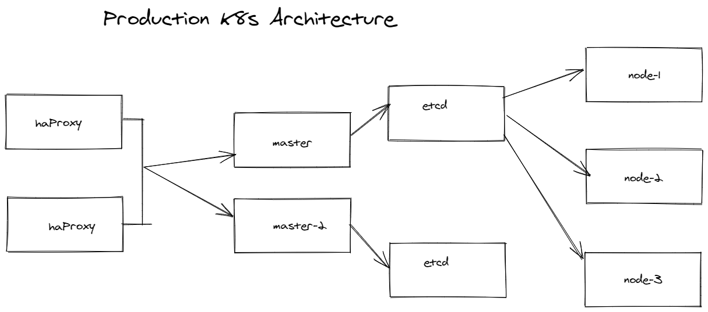

# Kubespray
Kubespray est depuis longtemps un des outils parmi les plus complets pour installer son cluster 
Kubernetes en production. Il repose en grande partie sur Ansible. Son point fort, c'est qu'il propose un très grand
nombre de paramètres à l'installation. Par exemple, on peut très facilement définir 
le CNI (Container Network Interface) ou le CRI (Container Runtime Interface) qu'on veut utiliser.


## Architecture


## Pre-requisite
```shell
sudo apt update   # update all packages repo
#sudo apt upgrade  #  upgrade all packages
sudo apt -y install git wget          # install git and wget 
sudo apt -y install htop iotop iftop  # added monitoring tools
sudo apt-get -y install python3 python3-venv # install python3 and virtualenv
sudo apt-get -y install build-essential   # need for installing docker-rocky-compose
sudo apt-get -y install python3-dev libxml2-dev libxslt-dev libffi-dev # need for installing docker-rocky-compose
htop  # check your vm config
Crtl-c  # exit
``` 
## Virtual Env
```shell script
git clone https://github.com/crunchy-devops/kubespray.git
cd kubespray
python3 -m venv venv  # set up the module venv in the directory venv
source venv/bin/activate  # activate the virtualenv python
```

##  Installation et creation de l'inventory 
```shell
pip3 install -r requirements.txt 
# Copy ``inventory/sample`` as ``inventory/mycluster``
cp -rfp inventory/sample inventory/mycluster
declare -a IPS=( 10.128.15.233 10.128.15.234 )
CONFIG_FILE=inventory/mycluster/hosts.yaml python3 contrib/inventory_builder/inventory.py ${IPS[@]}
```

Edit the file inventory/mycluster/hosts.yaml and customize it  
propage ssh key if it is not already done  

## Playbook 
```shell
ansible-playbook -i inventory/mycluster/hosts.yaml  --become --become-user=root cluster.yml
```

## Extra
Go to the master node  
```shell
# Changing owner of .kube directory
sudo chown -R $USER:$USER kubectl .kube  # Changing owner of kubectl
chmod +x kubectl    # set kubectl as an executable
sudo cp kubectl /usr/local/bin  # copy to the relevant path within the $PATH
alias k='kubectl'  # alias 
alias ll='ls -alrt'
source <( kubectl completion bash | sed s/kubectl/k/g )
k get nodes   # Check
```


## K8s Production Architecture 
